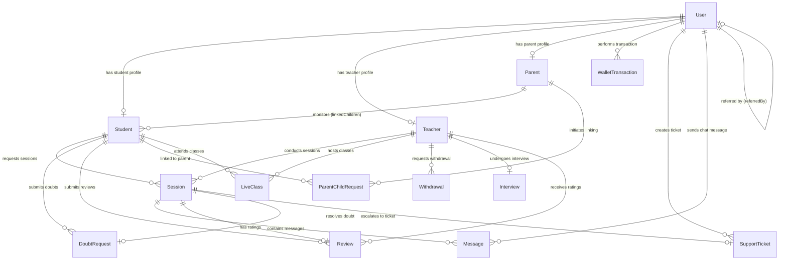

# Database Design & ER Diagrams

This document details the database architecture of **VLM Academy**, built on **MongoDB Atlas** using **Mongoose ODM**. It details all primary collections, their schemas, indexes, and relationships.

---

## 1. High-Level Entity Relationship Diagram (ERD)

Below is the entity-relationship diagram representing the core data structures and how they link.

---

## 2. Core Collections

### 2.1. User Schema (`User`)
Stores authentication details, roles, permissions, login history, and device registration.
* **Fields:**
  * `username` (String, Unique, Sparse)
  * `mobile` (String, Sparse)
  * `email` (String, Sparse)
  * `password` (String, Select: false)
  * `name` (String)
  * `role` (String: student, teacher, parent, admin)
  * `activeRole` (String)
  * `isSuperAdmin` (Boolean)
  * `permissions` (Array of Strings)
  * `status` (String: active, blocked, suspended)
  * `deviceTokens` (Array of Strings)
  * `referredBy` (ObjectId -> User)
* **Indexes:**
  * `{ mobile: 1, role: 1 }` (Unique, partial filter for non-empty strings)
  * `{ email: 1, role: 1 }` (Unique, partial filter for non-empty strings)

### 2.2. Student Schema (`Student`)
Contains grade level, board curriculum, favorite teachers, credit wallets, and parents linking.
* **Fields:**
  * `userId` (ObjectId -> User, Required, Unique)
  * `vlmStudentId` (String, Unique)
  * `firstName` / `middleName` / `lastName` (Strings)
  * `class` (String, Required)
  * `board` (String, Required)
  * `wallet` (Subdocument: points, balance, aiCredits, humanChatCredits, audioMinutes, videoMinutes)
  * `subscription` (Subdocument: planId -> Plan, status, trialEndsAt, expiresAt)
  * `linkedParents` (Array of ObjectIds -> Parent)

### 2.3. Teacher Schema (`Teacher`)
Stores academic backgrounds, bank details, experience summaries, teaching slots, and interview status.
* **Fields:**
  * `userId` (ObjectId -> User, Required, Unique)
  * `vlmTeacherId` (String, Unique)
  * `firstName` / `lastName` (Strings, Required)
  * `subjects` / `classes` / `boards` (Arrays of Strings)
  * `qualification` (Subdocument: highestQualification, instituteName, passingYear, hasBEd)
  * `experience` (Subdocument: totalYears, teachingModes, resumeUrl)
  * `bankDetails` (Subdocument: accountHolder, accountNumber, ifsc, bankName, upiId)
  * `wallet` (Subdocument: totalPoints, withdrawableBalance)
  * `availabilityStatus` (String: online, offline, busy)
  * `interview` (Subdocument: scheduledAt, slotId -> Interview, status)

### 2.4. Parent Schema (`Parent`)
Monitors child activity, limits usage hours/allowed timings, and handles credit redemption limits.
* **Fields:**
  * `userId` (ObjectId -> User, Required, Unique)
  * `fullName` (String, Required)
  * `linkedChildren` (Array of Subdocuments: studentId -> Student, status, linkedAt)
  * `controls` (Subdocument: dailyStudyHours, appUsageLimit, allowedTimings)

---

## 3. Session & Interaction Collections

### 3.1. Session Schema (`Session`)
Maintains session metadata, connection channels, recording credentials, transcripts, and financial logs.
* **Fields:**
  * `studentId` (ObjectId -> Student, Required)
  * `teacherId` (ObjectId -> Teacher)
  * `type` (String: chat, audio, video, live_class, short_live, ai)
  * `status` (String: pending, searching, active, completed, cancelled, missed, failed)
  * `agoraChannel` (String)
  * `duration` (Number)
  * `earnings` (Subdocument: points, status)
  * `recording` (Subdocument: url, status, duration)
  * `transcript` (String)

### 3.2. DoubtRequest Schema (`DoubtRequest`)
Manages the real-time routing queue of doubt queries to teachers.
* **Fields:**
  * `studentId` (ObjectId -> Student, Required)
  * `sessionId` (ObjectId -> Session)
  * `subject` / `class` / `board` (Strings)
  * `sessionType` (String)
  * `routedTeachers` (Array of Subdocuments: teacherId -> Teacher, status, respondedAt)
  * `assignedTeacherId` (ObjectId -> Teacher)
  * `status` (String: pending, searching, active, completed)

### 3.3. LiveClass Schema (`LiveClass`)
Scheduled classrooms hosted by certified teachers.
* **Fields:**
  * `teacherId` (ObjectId -> Teacher, Required)
  * `topic` (String, Required)
  * `scheduledAt` (Date)
  * `attendees` (Array of Subdocuments: studentId -> Student, joinedAt, leftAt)
  * `recording` (Subdocument: url, status)

---

## 4. Financial & Support Collections

### 4.1. WalletTransaction Schema (`WalletTransaction`)
Double-entry points and currency ledger tracking credit/debit records.
* **Fields:**
  * `userId` (ObjectId -> User, Required)
  * `role` (String: student, teacher)
  * `type` (String: credit, debit)
  * `earningType` (String: chat, audio, video, referral, penalty, etc.)
  * `points` (Number, Required)
  * `sessionId` (ObjectId -> Session)
  * `status` (String: pending, eligible, credited, reversed)

### 4.2. Withdrawal Schema (`Withdrawal`)
Manages teacher withdrawals of accumulated wallet points into INR.
* **Fields:**
  * `teacherId` (ObjectId -> Teacher, Required)
  * `amount` (Number, Required)
  * `points` (Number, Required)
  * `status` (String: pending, processing, processed, rejected)
  * `bankDetails` (Subdocument: accountHolder, accountNumber, bankName)

### 4.3. SupportTicket Schema (`SupportTicket`)
Handles platform issues, disputes, and student/teacher queries.
* **Fields:**
  * `userId` (ObjectId -> User, Required)
  * `category` (String: kyc, interview, session, wallet, withdrawal, bug, etc.)
  * `subject` (String, Required)
  * `description` (String, Required)
  * `status` (String: open, resolved, closed, etc.)
  * `sessionId` (ObjectId -> Session)
  * `replies` (Array of Subdocuments: senderId, message, createdAt)
